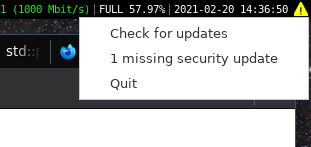

# arch-audit-gtk

Show an indicator if there are any security updates missing for your Arch Linux
system.



## Install

    pacman -S arch-audit-gtk

## Gnome3

For gnome3 you need to install an extension for app indicator support:

    pacman -S gnome-shell-extension-appindicator

After installing this extension you need to restart your desktop so gnome picks it up, you then need to enable the extension with the gnome extension manager.

## Privacy

Since this program is automatically pinging `security.archlinux.org` we attempt to use multiple techniques to increase privacy:

### Tor support

You can configure arch-audit to connect through Tor or any other socks5 proxy. There are two advantages in doing this:

- `security.archlinux.org` can't tell you apart from other arch-audit users using Tor.
- If you're on a monitored network they can't tell that you're connecting to `security.archlinux.org`, also they can't interrupt that specific connection. They may be able to tell that you're connecting to Tor and may be able to interrupt your Tor connections though.

Configure arch-audit like this:

```bash
mkdir -vp ~/.config/arch-audit
cat > ~/.config/arch-audit/settings.toml <<EOF
[network]
proxy = "socks5://127.0.0.1:9050"
EOF
```

### Random jitter

Even if the ip address is hidden, with a fixed update interval you'd need a very large set of people to make this reasonably anonymous. Instead we use a very large jitter and vary the update checks between 2-6h. Since this makes it virtually impossible to predict the next update check the server/network can't tell if a specific user is still there or went offline since the last check.

### Update conditions

The complete list of conditions that cause a connection to `security.archlinux.org`:

- Startup: On application start we do an initial check.
- Timer: There's an automatic update interval of 2-6h.
- Click: The user explicitly clicks on "Check for updates".
- Pacman hook: If we already know we're missing security updates and pacman notifies us that any package has been updated or uninstalled we check if the vulnerable package is still present.

## Development

    pacman -S git rust arch-audit
    git clone https://github.com/kpcyrd/arch-audit-gtk
    cd arch-audit-gtk
    cargo run

## License

GPLv3+
